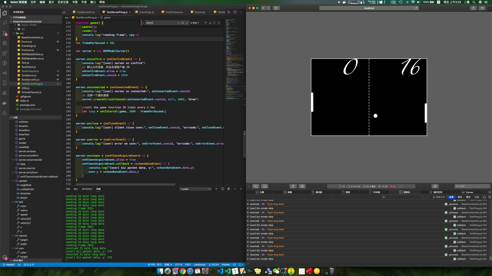

## 运算分配

| Task        | Assignment |
| ----------- | ---------- |
| Input       | 客户端     |
| 游戏树      | 服务端     |
| Timer       | 服务端     |
| 渲染 - 指令 | 服务端     |
| 渲染 - 执行 | 客户端     |

## 里程碑

1. 定义业务数据结构
    - MousePos：代表鼠标位置
      - x、y，共 3 字节
    - DrawRect：代表绘制操作
      - x、y，共 3 字节
      - width、height，共 2 字节
      - score、buffer，共 1 字节
      - score 代表得分，buffer 代表是否延迟绘制

**说明**：

用户移动鼠标时，向服务端发送 MousePos，服务器渲染画面时，向客户端发送 DrawRect。x、y 表示坐标，width、height 表示矩形宽高，当两者相等时按圆形绘制。

x、y 为 12 位无符号整数，width、height 为 8 位无符号整数。score 和 buffer 合并起来算一个字节，buffer 占符号位，只有 0 和 1，剩下 7 位留给 score，即个人最高得分为 127。

当 buffer 为 1 时，绘制指令在客户端做缓存，当 buffer 为 0 时，客户端刷掉画面，一次性执行完所有已缓存的绘制指令。buffer 位的设计，是为了减少画面撕裂、俗称“垂直同步”。

2. 客户端完成 DrawRect 的实现，以及缓存渲染指令的设计，服务端 60帧 循环发送渲染指令，测试网络模型和图形渲染正常工作
3. 服务端完成游戏树的定义、Timer、以及假渲染的实现，跑通单人 Pong 游戏的实现
4. 服务端完成多客户端的管理，实现当第 2 个人加入时变成双人游戏，跑通 Pong 完全体
5. 将 webserver 和 gameserver 打包进 docker 容器，部署到腾讯云